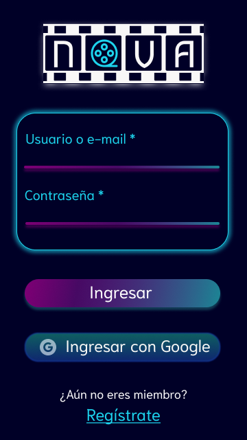
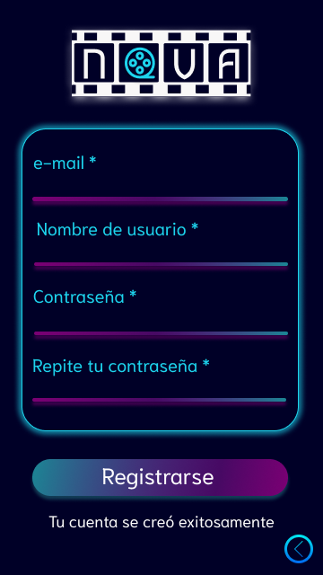
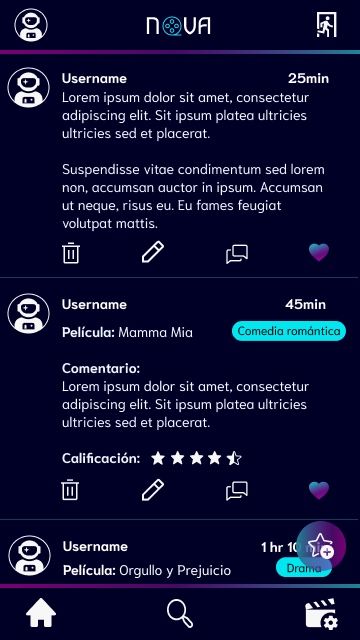

# Creando una Red Social - RED SOCIAL NOVA

## Índice

* [1. Resumen del proyecto](#1-resumen-del-proyecto)
* [2. Historias de usario](#2-historias-de-usario)
* [3. Objetivos de aprendizaje cumplidos](#3-objetivos-de-aprendizaje-cumplidos)
* [4. Prototipos de baja y alta fidelidad](#4-prototipos-de-baja-y-alta-fidelidad)
* [5. Acceso a nuestra red social](#5-acceso-a-nuestra-red-social)
* [6. Tecnologías utilizadas](#6-tecnologías-utilizadas)
* [7. Cocreadoras](#7-cocreadoras)

## 1. Resumen del proyecto

**NOVA** es una red social para todo cinéfilo o seriófilo que desea compartir recomendaciones o reseñas sobre sus series y películas favoritas. 

Esta red social podría ayudar al usuario a recordar todas las películas que vió durante el año, así como si le gustaron o no. De esta manera el usuario puede compartir con otros usuarios su opinión sobre diferentes películas, y de la misma manera, puede descubrir nuevas películas gracias a las reseñas de otros usuarios. Este servicio ayuda al usuario a reducir el tiempo que usa para encontrar una película y mejor utilizarlo en disfrutarla.

Para descubir las principales necesidades de nuestros usuarios, entrevistamos a dos personas por cada rango de edad que definimos: menores de 18 años, de 18 a 45 años y mayores de 46 años. Al comparar los datos que obtuvimos, delimitamos los puntos más importantes:
- Los usuarios prefieren que los posts tengan una estructura definida al crearlos y mostrarlos, donde se pueda escribir el título de la serie o película, escoger el género, escoger la calificación y escribir un comentario al respecto.
- Los usuarios desean que los posts aparezcan en orden cronológico, de los más recientes a los más antiguos.
- Los usuarios desean que la calificación aparezca con estrellitas dentro del post publicado.
- Los usurios desean utilizar un corazón para mostrar que les gusta una publicación.
- Los usuarios desean poder ingresar a ***NOVA*** con Google (gmail) o con correo electrónico y contraseña. 
- Los usuarios esperan tener un _Nombre de usuario_ diferente a su correo, que les permitta idenficarse fácilmente dentro de ***NOVA***
- Los usuarios desean tener una página personal para poder visualizar sus propias publicaciones.

## 2. Historias de usario

En este proyecto se escribieron 6 Historias de Usuario:

### ***HU1 Registro de Usuarios***
**YO COMO** usuario **QUIERO** poder crear una cuenta en la red social **PARA** poder acceder al contenido

#### Criterios de Aceptación
- Sólo puedo al mismo usuario una vez
- Puedo registrarme usando correo electrónico (gmail) válido, un usuario y una contraseña segura
- La red social debe permitirme confirmar mi contraseña. 
- La red social se adapta a cualquier dispositivo

#### Definición de Terminado
- Debe ser una single page
- haber recibido un feedback de otra compañera
- Test unitario
- Testeo manual buscando errores e imperfecciones simples
- Pruebas de usabilidad
- Incorporar feedback
- mostrar algún mensaje en caso de error
- La página de registro debe tener un input para nombre, correo, contraseña, repetir contraseña.
- El diseño en CSS debe respetar el prototipo de alta fidelidad. 
- El template debe incluir un botón que jalar la función de Firebase y mostrar en el HTML  si el registro fue exitoso o señalar error. 
- Se debe incluir un botón que permita regresar a la pantalla de LogIn.
- Crear las rutas para que se muestre el cambio de página. 

#### Tareas
- Crear prototipo de baja fidelidad
- Crear prototipo de alta fidelidad
- Elegir cuántas carpetas y archivos vamos a necesitar.
- Vincular el proyecto a Firebase
- Vincular y manejar Firebase Auth
- Hacer el template de Registro
- Hacer CSS mobile first
- Tener un archivo para la lógica de Firebase.
- Usar la función createUserWithEmailAndPassword
- Revisar que se guardaron los datos en Firebase
- Crear una función que permita obtener los valores de cada input
- Vincular los valores del input con la función de Firebase.
- Agregar la configuración de observador de estado
- Si el registro es exitoso, mostrar en el HTML el mensaje "Su cuenta se ha registrado exitosamente".

### ***HU2 Acceso a suarios ya registrados***
**YO COMO** usuario **QUIERO** acceder a mi cuenta (ya registrada) en la red social **PARA** poder visualizar mi contenido 

#### Criterios de Aceptación
- Que el formulario sólo me solicite el correo y la contraseña con las que me registré, o incluya un botón especial para iniciar con Google.
- Que pueda visualizar la página de iniciar sesión en cualquier dispositivo
- Que la navegación por la página sea accesible.
- Que la URL de la página tenga un pathname que se identifique con la pantalla en la que me encuentro .

#### Definición de Terminado
- Que valide si el usuario ya existe
- Si el usuario no existe, mandar un mensaje de error
- Validar si los datos ingresados en el input son correctos
- Debe ser una single page
- Haber recibido un feedback de otra compañera
- Test unitario
- Testeo manual buscando errores e imperfecciones simples
- Pruebas de usabilidad
- Incorporar feedback

#### Tareas
- Diseñar el template para iniciar sesión
- Crear CSS mobile first
- Desarrollar la función signInWithEmailAndPassword de Firebase
- Crear función que permita acceder con cuenta de Google
- Usar función que maneje errores de cuentas que ya existen con otras credenciales.

### ***HU3 Vista Home de la red social***
**YO COMO** usuario **QUIERO** que al iniciar sesión la red social me mandé a la pantalla _"Home"_ **PARA** visualizar mis publicaciones.

#### Criterios de Aceptación
- Al dar click en iniciar sesión, me mandé a una pantalla diferente
- Que en la pantalla Home pueda ver las publicaciones de otras personas.
- Que pueda visualizar la pantalla Home en cualquier dispositivo
- Que en la parte superior se vea un logo de "Perfil" junto con el logo de la Red Social y un icono para "Cerrar sesión"
- Que en la parte inferior de la pantalla tenga un menú que me llevé a Home, a "Buscar", o a "Configuración".
- Que en la pantalla Home las publicaciones aparezcan por orden (de la fecha más antigua al más reciente)

#### Definición de Terminado
- Crear prototipo de baja fidelidad
- Diseñar prototipo de alta fidelidad
- Crear template "Home"
- Revisar Firestore
- Debe ser una single page
- Haber recibido un feedback de otra compañera
- Test unitario
- Testeo manual buscando errores e imperfecciones simples
- Pruebas de usabilidad
- Incorporar feedback

#### Tareas
- Diseñar el prototipo de baja fidelidad
- Crear el prototipo de alta fidelidad en Figma de Home
- Crear el template de Home
- Utilizar los íconos que manejamos en Figma
- Víncular la página Home con el router para que se modifique la URL de nuestra página
- Reconocer cuantos botones y eventos serán necesarios aplicar en dicha vista
- Crear una función que guarde los datos del usuario.
- Crear una función que identifique si el usuario inicio sesión o no para permitirle visualizar la pantalla Home.
- Estudiar Firestore para analizar los datos que son necesarios
- Comenzar con el uso de Firestore para crear una colección con los post o reviews
- Crear la página de Editar perfil (si queremos que todos los íconos tengan funcionalidad)
- Checar las reglas de firestore para evitar que todos puedan ver la informacion
- Revisar que los posts no aparezcan dos veces en Home
- Darle estilo a posts para que se ajusten con el diseño de Home
- Diseñar la vista de posts para equipos de cómputo

### ***HU4 Crear un post***
**YO COMO** usuario **QUIERO** poder crear y publicar un post **PARA** calificar o recomendar una película/serie

#### Criterios de Aceptación
- Al darle click a un botón específico en home, este debería de llevarme a una página donde pueda crear mi publicación
- El post deberá de tener una estructura para que el usuario llene la información y de una reseña valiosa
- La estructura debe de contener título, género, calificación y comentario
- Debe contener un boton para regresar al home en caso de que ya no quiera crear la publicación
- Debe contener un boton para ingresar la información
- Debe mantener el mismo diseño que las otras pantallas, respetando la paleta de colores.

#### Definición de Terminado
- Debe ser una single page
- Haber recibido un feedback de otra compañera
- Test unitario
- Testeo manual buscando errores e imperfecciones simples
- Pruebas de usabilidad
- Incorporar feedback
- Debe existir una colección en Firestore de "posts"
- CSS responsive

#### Tareas
- Crear prototipo de alta fidelidad para la página "posts"
- Crear template para la creación de la publicación
- Hacer el routing para entrar y salir de la pantalla de creación de la publicación
- Crear colección en Firestore que guarde la información de las publicaciones
- Guardar los valores de los input de post
- Buscar cómo pasar la información del formulario de creación a la colección de Firebase
- Verificar las reglas de Firestore
- Buscar cómo hacer que la publicación aparezca en Home
- Crear los eventos que permitan cambiar de pantallas y publicar

### ***HU5 Interacción con el post***
**YO COMO** usuario **QUIERO** poder darle like/ comentar/ editar/ eliminar los post **PARA** interactuar con mis publicaciones y las de otras personas.

#### Criterios de Aceptación
- Que solo yo pueda editar y borrar mis propias publicaciones
- Que cualquier persona pueda darle like a mis publicaciones
- Que yo pueda darle like a las publicaciones de los demás
- Que cuando le de click al botón de editar, me lleve a una nueva página donde ya se encuentre toda la información de la publicación
- Que cuando quiera borrar mis publicaciones, me aparezca un mensaje de confirmación

#### Definición de Terminado
- Debe ser una single page
- Haber recibido un feedback de otra compañera
- Test unitario
- Testeo manual buscando errores e imperfecciones simples
- Pruebas de usabilidad
- Incorporar feedback

#### Tareas
- Hacer que los botones borrar y editar aparezcan sólo para el creador del post
- Crear un botón de like con el ícono elegido en el prototipo
- Que la interacción de los botones sea por publicación
- Crear función borrar post
- Crear función editar y update post
- Crear función para darle like, guardarlo en el array y contar el número de elementos en el array

### ***HU6 Cerrar sesión***
**YO COMO** usuario **QUIERO** que la Red Social me permita cerrar mi sesión **PARA** proteger mi privacidad y evitar que otros manipulen mis publicaciones

#### Criterios de Aceptación
- Quiero tener un botón que me permita cerrar sesión en la Red Social
- Al momento de cerrar sesión, y para verificar que mis datos están protegidos, espero que la página no pueda regresarse y mostrar _"Home"_

#### Definición de Terminado
- Debe ser una single page
- Haber recibido un feedback de otra compañera
- Test unitario
- Testeo manual buscando errores e imperfecciones simples
- Pruebas de usabilidad
- Incorporar feedback

#### Tareas
- Poner un icono que represente al logOut
- Crear la función de signOut en firebase
- Vincular la funcion signOut con la función onNavigate
- Crear una validación con onAuthStateChanged para verificar que el usuario ya no está logueado
- Cambiar el onpopState cuando el usuario no esté logueado para proteger su privacidad

## 3. Objetivos de aprendizaje cumplidos

### HTML

- [x] Uso de HTML semántico

### CSS

- [x] Uso de selectores de CSS
  
- [x] Modelo de caja (box model): borde, margen, padding
  
- [x] Uso de flexbox en CSS

### Web APIs

- [x] Uso de selectores del DOM
  
- [x] Manejo de eventos del DOM (listeners, propagación, delegación)
  
- [x] Manipulación dinámica del DOM
  
- [x] Ruteado (History API, evento hashchange, window.location)

### JavaScript

- [x] Arrays (arreglos)
  
- [x] Objetos (key, value)
  
- [x] Diferenciar entre tipos de datos primitivos y no primitivos
  
- [x] Variables (declaración, asignación, ámbito)
  
- [x] Uso de condicionales (if-else, switch, operador ternario, lógica booleana)
  
- [x] Uso de bucles/ciclos (while, for, for..of)
  
- [x] Funciones (params, args, return)
  
- [x] Pruebas unitarias (unit tests)
  
- [x] Pruebas asíncronas
  
- [x] Uso de mocks y espías
  
- [x] Módulos de ECMAScript (ES Modules)
  
- [x] Uso de linter (ESLINT)
  
- [x] Uso de identificadores descriptivos (Nomenclatura y Semántica)
  
- [x] Diferenciar entre expresiones (expressions) y sentencias (statements)
  
- [x] Callbacks
  
- [x] Promesas

### Git y Github

- [x] Uso de comandos de git (add | commit | pull | status | push)

- [x] Manejo de repositorios de GitHub (clone | fork | gh-pages)

- [x] Colaboración en Github (branches | pull requests | |tags)

- [x] Organización en Github (projects | issues | labels | milestones)

### UX (User eXperience)

- [x] Diseñar la aplicación pensando en y entendiendo al usuario

- [x] Crear prototipos para obtener feedback e iterar

- [x] Aplicar los principios de diseño visual (contraste, alineación, jerarquía)

- [x] Planear y ejecutar tests de usabilidad

### Firebase

- [x] Firebase Auth

- [x] Firestore

## 4. Prototipos de baja y alta fidelidad

### Prototipos de baja fidelidad

### Prototipos de alta fidelidad

Acceso al prototipo en [Figma](https://www.figma.com/file/SVWYnBEJLvsVkxcpYU7WFo/Red-Social-NOVA?node-id=0%3A1)

## 5. Acceso a nuestra red social

Consulta el siguiente enlace ara acceder a **NOVA**: 
https://red-social-nova.web.app/

Si no deseas registrarte, puedes utilizar la siguiente cuenta para ingresar:

**Correo:** _prueba@nova.com_

**Contraseña:** _123abc_

## 6. Tecnologías utilizadas
- HTML
- CSS
- Vanilla JS
- Firebase y Firestore
- Figma 
- Jest

## 7. Cocreadoras
 - [Emma Aguila](https://github.com/emmaspace)
 - [Isabel Valdés](https://github.com/isvaoc)
 - [Angélica Venta](https://github.com/AngieVenta)